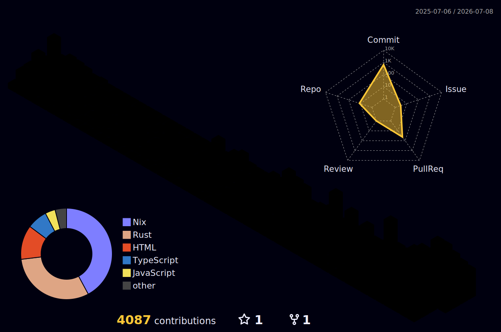

<div align="center">


</div>

<br>

<div align="center">

```console
rc-code-jp@github:~$ sudo whoami --unlock

  ╔═══════════════════════════════════════════════════════╗
  ║   ✦ Name       : Ryosuke Canai                        ║
  ║   ✦ Class      : Web Engineer 👨‍💻  Lv.∞               ║
  ║   ✦ Location   : /usr/local/bin                       ║
  ║   ✦ Weapons    : TypeScript ⚔ Rust ⚔ Go ⚔ Dart        ║
  ║   ✦ Special    : AI × Dev Tools · TUI · Architecture  ║
  ║   ✦ Guild      : Terminal Dwellers 🖥️                 ║
  ╚═══════════════════════════════════════════════════════╝

  [██████████████████████████░░░░]  87% — compiling dreams...

rc-code-jp@github:~$ █
```

</div>

<br>

<div align="center">

## ⚔️ ARSENAL

<a href="https://skillicons.dev">
  
</a>

<br><br>


## 🌌 CONTRIBUTION GALAXY — 3D



<br>


## 📊 BATTLE STATS


<br><br>


<br><br>


<br><br>


<br>


## 🐍 THE SNAKE NEVER SLEEPS

<picture>
  <source media="(prefers-color-scheme: dark)" srcset="https://raw.githubusercontent.com/rc-code-jp/rc-code-jp/output/github-contribution-grid-snake-dark.svg" />
  <source media="(prefers-color-scheme: light)" srcset="https://raw.githubusercontent.com/rc-code-jp/rc-code-jp/output/github-contribution-grid-snake.svg" />
  
</picture>

<br><br>


### ⚡ *"Small tools, sharp edges."* ⚡


</div>
